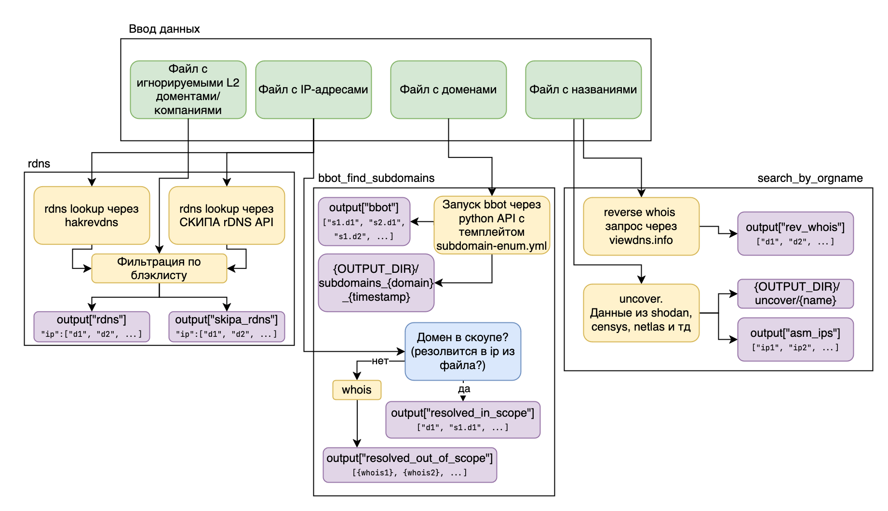

## **Установка**

1. **Клонирование репозитория**:
    ```bash
    git clone https://REDACTED/REDACTED/scope_recon
    cd scope_recon
    ```
2. **Подстановка API ключей.**
Создайте файл `uncover-config.yaml` для использования `uncover`.
Создайте файл `bbot/bbot.yml` для размещения в нем API ключей инструментов, совместимых с bbot.
Опционально, создайте файл `fofa_key.txt` для использования поиска по favicon.
3. **Сборка Docker-образа**:
    ```bash
    docker build -t scope_recon .
    ```
Для сборки контейнера на устройствах с ARM процессорами Apple Silicon:
```bash
docker buildx build --platform=linux/amd64 -t scope_recon .
```
4. **Запуск контейнера**:
    ```bash
    docker run -v "$(pwd):/mnt" scope_recon
    ```
Для ускорения резолва доменов bbot'ом рекомендуется заменить сервер с `8.8.8.8` на `1.1.1.1`, так как Google DNS ограничивает количество запросов в секунду
При запуске контейнера можно указать `--dns=1.1.1.1`

## **Использование**

### **Аргументы командной строки**:

- `-n, --projname` - Название проекта, в папке которого будут все результаты
- `-i, --ips` (необязательный) — Путь к файлу с IP-адресами
    - Пример: `--ips ips.txt`

- `-d, --domains` (необязательный) — Путь к файлу с доменами
    - Пример: `--domains domains.txt`

- `-b, --blacklist` (необязательный) — Путь к файлу с черным списком хостов, которые нужно исключить
    - Пример: `--blacklist blacklist.txt`
- `-o, --orgnames` (необязательный) — Путь к файлу со списком названий компании и их вариаций
- `-f, --favicons` (необязательный) — Путь к файлу с доменами для поиска по favicon.
Поиск по фавайконам вынесен отдельно потому что результаты необходимо верифицировать вручную

### **Пример использования**:

Пример запуска скрипта с IP-адресами и доменами (файлы переносятся в /mnt/):
```bash
docker run -v "$(pwd):/mnt" --dns=1.1.1.1 scope_recon --projname test_scan --ips /mnt/ips.txt --domains /mnt/domains.txt
```

## Примерная схема работы:


Для начала собирается список названий и вариаций названия компании (для REDACTED, например, это `REDACTED, REDACTED, REDACTED`), по ним проводится reverse whois запросы и поиск в ASM. На этом этапе выполнения выдается соответственно список доменов из reverse whois и ip адресов с их rdns'ами (если это возможно) из ASMов. Они могут содержать фолс-позитивы поэтому после этого этапа эти данные необходимо проверить вручную, посмотреть что это за сайты и тд.

Подходящие домены и IP адреса вносятся в соответствующие файлы, по которым потом прогоняется проверка с ключами `--domains` и `--ips` соответственно.

На данных этапах по IP адресам проводятся стандартные rDNS запросы и rDNS запросы к СКИПА, при этом оставляются только те домены, которые не указаны в черных списках.

Для доменов проводится пассивный (поиск по различным ASMам и другим системам) и активный (брутфорс) поиск поддоменов. Если указан как список доменов, так и список IP-адресов, то производится разделение доменов на in-scope и out-of-scope по их принадлежности к данному списку ip-адресов.

Отдельно реализована функция поиска доменов и поддоменов по Favicon (`--favicons`). Результаты также необходимо оценивать вручную, потому что иногда на интересующих нас сайтах стоит не уникальный favicon, а, например, favicon используемого сервиса (например wordpress).
